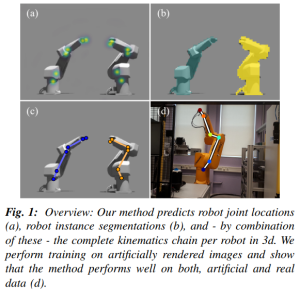

# 3D Robot Pose Estimation from 2D Images

This repository contains data accompanying our work on robot pose estimation from 2D images. The following illustration is from our paper (to be published).

<p align="center">
    <br/>
    From our paper "3D Robot Pose Estimation from 2D Images", Heindl et al.
</p>

The following [short video](https://www.youtube.com/watch?v=1BrgI_nI8nE&feature=youtu.be) shows how our model generalizes from artificial training data to real world images. The model was trained on 10.000 non-realistic images of robots (joint angle-range [-30,30] degrees).

## Architecture Details
While we don't share source code at this time, we provide architecture details of our models.

**Joint-Model**
```
RobotJointModel(
  (features): Sequential(
    (0): Normalize()
    (1): Sequential(
      (0): Conv2d(3, 64, kernel_size=(3, 3), stride=(1, 1), padding=(1, 1))
      (1): ReLU(inplace)
      (2): Conv2d(64, 64, kernel_size=(3, 3), stride=(1, 1), padding=(1, 1))
      (3): ReLU(inplace)
      (4): MaxPool2d(kernel_size=2, stride=2, padding=0, dilation=1, ceil_mode=False)
      (5): Conv2d(64, 128, kernel_size=(3, 3), stride=(1, 1), padding=(1, 1))
      (6): ReLU(inplace)
      (7): Conv2d(128, 128, kernel_size=(3, 3), stride=(1, 1), padding=(1, 1))
      (8): ReLU(inplace)
      (9): MaxPool2d(kernel_size=2, stride=2, padding=0, dilation=1, ceil_mode=False)
      (10): Conv2d(128, 256, kernel_size=(3, 3), stride=(1, 1), padding=(1, 1))
      (11): ReLU(inplace)
    )
  )
  (stages): ModuleList(
    (0): Sequential(
      (0): Conv2d(256, 128, kernel_size=(3, 3), stride=(1, 1), padding=(1, 1), bias=False)
      (1): BatchNorm2d(128, eps=1e-05, momentum=0.1, affine=True, track_running_stats=True)
      (2): ReLU()
      (3): Conv2d(128, 128, kernel_size=(3, 3), stride=(1, 1), padding=(1, 1), bias=False)
      (4): BatchNorm2d(128, eps=1e-05, momentum=0.1, affine=True, track_running_stats=True)
      (5): ReLU()
      (6): Conv2d(128, 128, kernel_size=(3, 3), stride=(1, 1), padding=(1, 1), bias=False)
      (7): BatchNorm2d(128, eps=1e-05, momentum=0.1, affine=True, track_running_stats=True)
      (8): ReLU()
      (9): Conv2d(128, 512, kernel_size=(1, 1), stride=(1, 1))
      (10): ReLU()
      (11): Conv2d(512, 7, kernel_size=(1, 1), stride=(1, 1))
      (12): Sigmoid()
    )
    (1): Sequential(
      (0): Conv2d(263, 128, kernel_size=(7, 7), stride=(1, 1), padding=(3, 3), bias=False)
      (1): BatchNorm2d(128, eps=1e-05, momentum=0.1, affine=True, track_running_stats=True)
      (2): ReLU()
      (3): Conv2d(128, 128, kernel_size=(7, 7), stride=(1, 1), padding=(3, 3), bias=False)
      (4): BatchNorm2d(128, eps=1e-05, momentum=0.1, affine=True, track_running_stats=True)
      (5): ReLU()
      (6): Conv2d(128, 128, kernel_size=(7, 7), stride=(1, 1), padding=(3, 3), bias=False)
      (7): BatchNorm2d(128, eps=1e-05, momentum=0.1, affine=True, track_running_stats=True)
      (8): ReLU()
      (9): Conv2d(128, 128, kernel_size=(7, 7), stride=(1, 1), padding=(3, 3), bias=False)
      (10): BatchNorm2d(128, eps=1e-05, momentum=0.1, affine=True, track_running_stats=True)
      (11): ReLU()
      (12): Conv2d(128, 128, kernel_size=(7, 7), stride=(1, 1), padding=(3, 3), bias=False)
      (13): BatchNorm2d(128, eps=1e-05, momentum=0.1, affine=True, track_running_stats=True)
      (14): ReLU()
      (15): Conv2d(128, 512, kernel_size=(1, 1), stride=(1, 1))
      (16): ReLU()
      (17): Conv2d(512, 7, kernel_size=(1, 1), stride=(1, 1))
      (18): Sigmoid()
    )
    (2): Sequential(
      (0): Conv2d(263, 128, kernel_size=(7, 7), stride=(1, 1), padding=(3, 3), bias=False)
      (1): BatchNorm2d(128, eps=1e-05, momentum=0.1, affine=True, track_running_stats=True)
      (2): ReLU()
      (3): Conv2d(128, 128, kernel_size=(7, 7), stride=(1, 1), padding=(3, 3), bias=False)
      (4): BatchNorm2d(128, eps=1e-05, momentum=0.1, affine=True, track_running_stats=True)
      (5): ReLU()
      (6): Conv2d(128, 128, kernel_size=(7, 7), stride=(1, 1), padding=(3, 3), bias=False)
      (7): BatchNorm2d(128, eps=1e-05, momentum=0.1, affine=True, track_running_stats=True)
      (8): ReLU()
      (9): Conv2d(128, 128, kernel_size=(7, 7), stride=(1, 1), padding=(3, 3), bias=False)
      (10): BatchNorm2d(128, eps=1e-05, momentum=0.1, affine=True, track_running_stats=True)
      (11): ReLU()
      (12): Conv2d(128, 128, kernel_size=(7, 7), stride=(1, 1), padding=(3, 3), bias=False)
      (13): BatchNorm2d(128, eps=1e-05, momentum=0.1, affine=True, track_running_stats=True)
      (14): ReLU()
      (15): Conv2d(128, 512, kernel_size=(1, 1), stride=(1, 1))
      (16): ReLU()
      (17): Conv2d(512, 7, kernel_size=(1, 1), stride=(1, 1))
      (18): Sigmoid()
    )
    (3): Sequential(
      (0): Conv2d(263, 128, kernel_size=(7, 7), stride=(1, 1), padding=(3, 3), bias=False)
      (1): BatchNorm2d(128, eps=1e-05, momentum=0.1, affine=True, track_running_stats=True)
      (2): ReLU()
      (3): Conv2d(128, 128, kernel_size=(7, 7), stride=(1, 1), padding=(3, 3), bias=False)
      (4): BatchNorm2d(128, eps=1e-05, momentum=0.1, affine=True, track_running_stats=True)
      (5): ReLU()
      (6): Conv2d(128, 128, kernel_size=(7, 7), stride=(1, 1), padding=(3, 3), bias=False)
      (7): BatchNorm2d(128, eps=1e-05, momentum=0.1, affine=True, track_running_stats=True)
      (8): ReLU()
      (9): Conv2d(128, 128, kernel_size=(7, 7), stride=(1, 1), padding=(3, 3), bias=False)
      (10): BatchNorm2d(128, eps=1e-05, momentum=0.1, affine=True, track_running_stats=True)
      (11): ReLU()
      (12): Conv2d(128, 128, kernel_size=(7, 7), stride=(1, 1), padding=(3, 3), bias=False)
      (13): BatchNorm2d(128, eps=1e-05, momentum=0.1, affine=True, track_running_stats=True)
      (14): ReLU()
      (15): Conv2d(128, 512, kernel_size=(1, 1), stride=(1, 1))
      (16): ReLU()
      (17): Conv2d(512, 7, kernel_size=(1, 1), stride=(1, 1))
      (18): Sigmoid()
    )
    (4): Sequential(
      (0): Conv2d(263, 128, kernel_size=(7, 7), stride=(1, 1), padding=(3, 3), bias=False)
      (1): BatchNorm2d(128, eps=1e-05, momentum=0.1, affine=True, track_running_stats=True)
      (2): ReLU()
      (3): Conv2d(128, 128, kernel_size=(7, 7), stride=(1, 1), padding=(3, 3), bias=False)
      (4): BatchNorm2d(128, eps=1e-05, momentum=0.1, affine=True, track_running_stats=True)
      (5): ReLU()
      (6): Conv2d(128, 128, kernel_size=(7, 7), stride=(1, 1), padding=(3, 3), bias=False)
      (7): BatchNorm2d(128, eps=1e-05, momentum=0.1, affine=True, track_running_stats=True)
      (8): ReLU()
      (9): Conv2d(128, 128, kernel_size=(7, 7), stride=(1, 1), padding=(3, 3), bias=False)
      (10): BatchNorm2d(128, eps=1e-05, momentum=0.1, affine=True, track_running_stats=True)
      (11): ReLU()
      (12): Conv2d(128, 128, kernel_size=(7, 7), stride=(1, 1), padding=(3, 3), bias=False)
      (13): BatchNorm2d(128, eps=1e-05, momentum=0.1, affine=True, track_running_stats=True)
      (14): ReLU()
      (15): Conv2d(128, 512, kernel_size=(1, 1), stride=(1, 1))
      (16): ReLU()
      (17): Conv2d(512, 7, kernel_size=(1, 1), stride=(1, 1))
      (18): Sigmoid()
    )
    (5): Sequential(
      (0): Conv2d(263, 128, kernel_size=(7, 7), stride=(1, 1), padding=(3, 3), bias=False)
      (1): BatchNorm2d(128, eps=1e-05, momentum=0.1, affine=True, track_running_stats=True)
      (2): ReLU()
      (3): Conv2d(128, 128, kernel_size=(7, 7), stride=(1, 1), padding=(3, 3), bias=False)
      (4): BatchNorm2d(128, eps=1e-05, momentum=0.1, affine=True, track_running_stats=True)
      (5): ReLU()
      (6): Conv2d(128, 128, kernel_size=(7, 7), stride=(1, 1), padding=(3, 3), bias=False)
      (7): BatchNorm2d(128, eps=1e-05, momentum=0.1, affine=True, track_running_stats=True)
      (8): ReLU()
      (9): Conv2d(128, 128, kernel_size=(7, 7), stride=(1, 1), padding=(3, 3), bias=False)
      (10): BatchNorm2d(128, eps=1e-05, momentum=0.1, affine=True, track_running_stats=True)
      (11): ReLU()
      (12): Conv2d(128, 128, kernel_size=(7, 7), stride=(1, 1), padding=(3, 3), bias=False)
      (13): BatchNorm2d(128, eps=1e-05, momentum=0.1, affine=True, track_running_stats=True)
      (14): ReLU()
      (15): Conv2d(128, 512, kernel_size=(1, 1), stride=(1, 1))
      (16): ReLU()
      (17): Conv2d(512, 7, kernel_size=(1, 1), stride=(1, 1))
      (18): Sigmoid()
    )
  )
)
```

**Instance-Model**
```
RobotInstanceModel(
  (joint_model): RobotJointModel(...)
  (gru): ModuleList(
    (0): ConvGRUCell(
      (reset_gate): Conv2d(526, 263, kernel_size=(3, 3), stride=(1, 1), padding=(1, 1))
      (update_gate): Conv2d(526, 263, kernel_size=(3, 3), stride=(1, 1), padding=(1, 1))
      (out_gate): Conv2d(526, 263, kernel_size=(3, 3), stride=(1, 1), padding=(1, 1))
    )
  )
  (downconv): Sequential(
    (0): Sequential(
      (0): Conv2d(263, 263, kernel_size=(3, 3), stride=(1, 1))
      (1): BatchNorm2d(263, eps=1e-05, momentum=0.1, affine=True, track_running_stats=True)
      (2): LeakyReLU(negative_slope=0.01)
      (3): MaxPool2d(kernel_size=2, stride=2, padding=0, dilation=1, ceil_mode=False)
    )
    (1): Sequential(
      (0): Conv2d(263, 263, kernel_size=(3, 3), stride=(1, 1))
      (1): BatchNorm2d(263, eps=1e-05, momentum=0.1, affine=True, track_running_stats=True)
      (2): LeakyReLU(negative_slope=0.01)
      (3): MaxPool2d(kernel_size=2, stride=2, padding=0, dilation=1, ceil_mode=False)
    )
    (2): Sequential(
      (0): Conv2d(263, 263, kernel_size=(3, 3), stride=(1, 1))
      (1): BatchNorm2d(263, eps=1e-05, momentum=0.1, affine=True, track_running_stats=True)
      (2): LeakyReLU(negative_slope=0.01)
      (3): MaxPool2d(kernel_size=2, stride=2, padding=0, dilation=1, ceil_mode=False)
    )
  )
  (conv1x1): Sequential(
    (0): Conv2d(263, 263, kernel_size=(3, 3), stride=(1, 1))
    (1): ReLU()
    (2): Dropout2d(p=0.25)
    (3): Conv2d(263, 263, kernel_size=(3, 3), stride=(1, 1))
    (4): ReLU()
    (5): Conv2d(263, 1, kernel_size=(1, 1), stride=(1, 1))
    (6): Sigmoid()
  )
)
```


